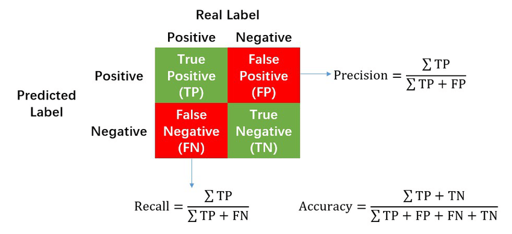
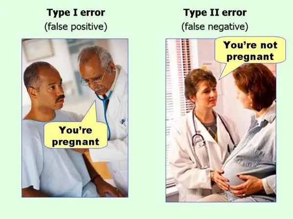
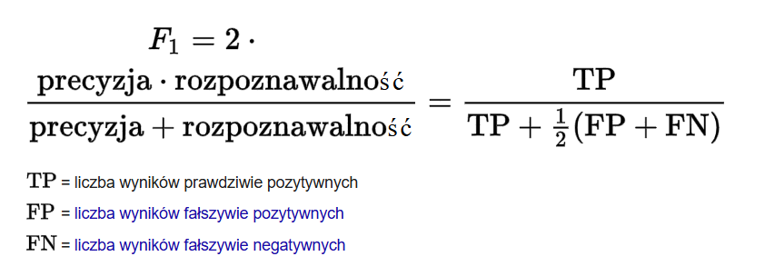
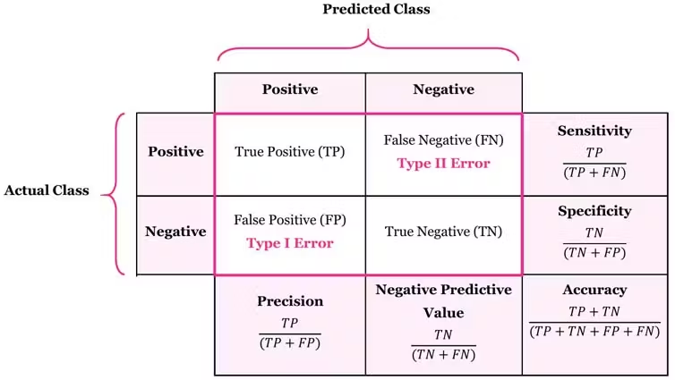
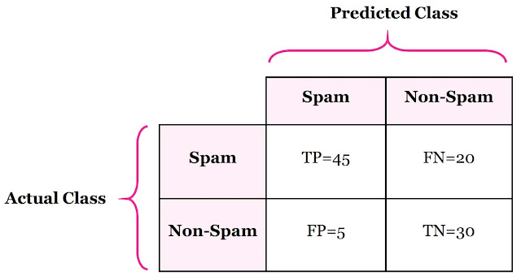
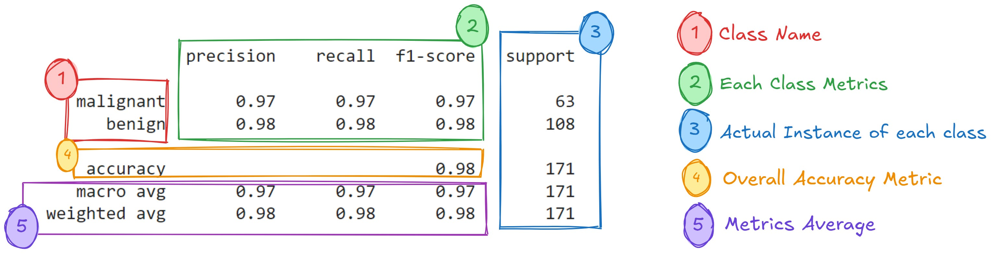
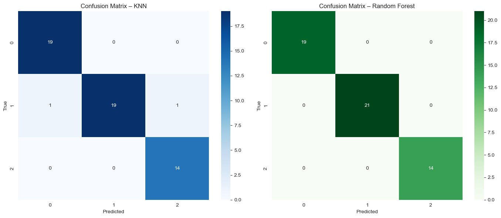

# Uczenie nadzorowane - klasyfikacja
----
#### Opracował: Kacper Książek ( 417564 )
W ramach przedmiotu **Uczenie Maszynowe**.


```python
import pandas as pd
from random import seed
from sklearn.model_selection import train_test_split
from sklearn.preprocessing import StandardScaler
from sklearn.neighbors import KNeighborsClassifier
from sklearn.ensemble import RandomForestClassifier
from sklearn.metrics import classification_report, confusion_matrix, accuracy_score
import seaborn as sns
import matplotlib.pyplot as plt

seed(417564)
```

### 1. Wczytaj zbiór danych


```python
columns = [
    "Class", "Alcohol", "Malic_acid", "Ash", "Alcalinity_of_ash",
    "Magnesium", "Total_phenols", "Flavanoids", "Nonflavanoid_phenols",
    "Proanthocyanins", "Color_intensity", "Hue", "OD280_OD315", "Proline"
]

data = pd.read_csv("./dane/wine.data", header=None, names=columns)

data.head()
```


<div>
<style scoped>
    .dataframe tbody tr th:only-of-type {
        vertical-align: middle;
    }

    .dataframe tbody tr th {
        vertical-align: top;
    }

    .dataframe thead th {
        text-align: right;
    }
</style>
<table border="1" class="dataframe">
  <thead>
    <tr style="text-align: right;">
      <th></th>
      <th>Class</th>
      <th>Alcohol</th>
      <th>Malic_acid</th>
      <th>Ash</th>
      <th>Alcalinity_of_ash</th>
      <th>Magnesium</th>
      <th>Total_phenols</th>
      <th>Flavanoids</th>
      <th>Nonflavanoid_phenols</th>
      <th>Proanthocyanins</th>
      <th>Color_intensity</th>
      <th>Hue</th>
      <th>OD280_OD315</th>
      <th>Proline</th>
    </tr>
  </thead>
  <tbody>
    <tr>
      <th>0</th>
      <td>1</td>
      <td>14.23</td>
      <td>1.71</td>
      <td>2.43</td>
      <td>15.6</td>
      <td>127</td>
      <td>2.80</td>
      <td>3.06</td>
      <td>0.28</td>
      <td>2.29</td>
      <td>5.64</td>
      <td>1.04</td>
      <td>3.92</td>
      <td>1065</td>
    </tr>
    <tr>
      <th>1</th>
      <td>1</td>
      <td>13.20</td>
      <td>1.78</td>
      <td>2.14</td>
      <td>11.2</td>
      <td>100</td>
      <td>2.65</td>
      <td>2.76</td>
      <td>0.26</td>
      <td>1.28</td>
      <td>4.38</td>
      <td>1.05</td>
      <td>3.40</td>
      <td>1050</td>
    </tr>
    <tr>
      <th>2</th>
      <td>1</td>
      <td>13.16</td>
      <td>2.36</td>
      <td>2.67</td>
      <td>18.6</td>
      <td>101</td>
      <td>2.80</td>
      <td>3.24</td>
      <td>0.30</td>
      <td>2.81</td>
      <td>5.68</td>
      <td>1.03</td>
      <td>3.17</td>
      <td>1185</td>
    </tr>
    <tr>
      <th>3</th>
      <td>1</td>
      <td>14.37</td>
      <td>1.95</td>
      <td>2.50</td>
      <td>16.8</td>
      <td>113</td>
      <td>3.85</td>
      <td>3.49</td>
      <td>0.24</td>
      <td>2.18</td>
      <td>7.80</td>
      <td>0.86</td>
      <td>3.45</td>
      <td>1480</td>
    </tr>
    <tr>
      <th>4</th>
      <td>1</td>
      <td>13.24</td>
      <td>2.59</td>
      <td>2.87</td>
      <td>21.0</td>
      <td>118</td>
      <td>2.80</td>
      <td>2.69</td>
      <td>0.39</td>
      <td>1.82</td>
      <td>4.32</td>
      <td>1.04</td>
      <td>2.93</td>
      <td>735</td>
    </tr>
  </tbody>
</table>
</div>


#### Opis kolumn w zbiorze danych 🍷🤖

Ten krotki opis kolumn zostal wygenerowany przez AI, zeby lepiej zrozumiec, co oznacza kazda cecha w zbiorze danych wina:

- **Class** — klasa wina (1, 2 lub 3), czyli typ szczepu
- **Alcohol** — zawartosc alkoholu
- **Malic_acid** — kwas jabłkowy
- **Ash** — zawartosc popiołu
- **Alcalinity_of_ash** — zasadowosc popiołu
- **Magnesium** — poziom magnezu
- **Total_phenols** — laczna zawartosc fenoli
- **Flavanoids** — flavonoidy, rodzaj fenoli
- **Nonflavanoid_phenols** — fenole niebędace flavonoidami
- **Proanthocyanins** — proantocyjaniny (antyoksydanty)
- **Color_intensity** — intensywnosc koloru
- **Hue** — odcien koloru
- **OD280_OD315** — absorbancja przy falach 280 i 315 nm (cecha chemiczna)
- **Proline** — poziom proliny, aminokwas

### 2. Podziel zbiór danych na zbiór treningowy i testowy, dodatkowo w zmiennej X zapisz macierz zmiennych niezależnych, w zmiennej Y zapisz wektor zawierający informacje o tym jaki jest to typ wina (1, 2, 3).


```python
X = data.drop("Class", axis=1)
Y = data["Class"]

X_train, X_test, Y_train, Y_test = train_test_split(X, Y, test_size=0.3, random_state=42)

print(f"Rozmiar X_train: {X_train.shape}")
print(f"Rozmiar X_test: {X_test.shape}")
print(f"Rozmiar Y_train: {Y_train.shape}")
print(f"Rozmiar Y_test: {Y_test.shape}")
```

    Rozmiar X_train: (124, 13)
    Rozmiar X_test: (54, 13)
    Rozmiar Y_train: (124,)
    Rozmiar Y_test: (54,)
    

### 3. Dokonaj normalizacji danych. Skomentuj po co jest ten krok i jak może on wpływać na działania algorytmów z kolejnego punktu.

Normalizacja to przeskalowanie cech do podobnego zakresu (np. 0 do 1 lub srednia 0, odchylenie 1).
Dzieki temu algorytmy uczace sie szybciej i stabilniej, bo nie "faworyzuja" cech o duzych wartosciach.

Przyklad: Alkohol i Proline maja rozne skale, wiec bez normalizacji model moze zle interpretowac ich wplyw


```python
scaler = StandardScaler()

X_train_scaled = scaler.fit_transform(X_train)

X_test_scaled = scaler.transform(X_test)

print(f"Srednia po normalizacji (X_train): {X_train_scaled.mean(axis=0)}")
print("\n")
print(f"Odchylenie po normalizacji (X_train): {X_train_scaled.std(axis=0)}")
```

    Srednia po normalizacji (X_train): [-1.70652023e-15  1.13932161e-16  1.33092462e-15 -2.82032462e-17
      2.33460205e-16  5.09001443e-16  1.14155996e-17  4.26853893e-16
     -4.23496363e-16  5.83762429e-16  5.28251278e-17  2.72183709e-16
      5.01391043e-17]
    
    
    Odchylenie po normalizacji (X_train): [1. 1. 1. 1. 1. 1. 1. 1. 1. 1. 1. 1. 1.]
    

### 4. Wykonaj trening dla algorytmów KNeighborsClassifier oraz RandomForestClassifier (biblioteka scikit-learn):


Krotki opis uzytych w tym punkcie algorytmów:
- **KNeighborsClassifier (KNN)** — model bazujacy na odleglosci miedzy probkami, szuka najblizszych sasiadow,
- **RandomForestClassifier (RF)** — zespol drzew decyzyjnych, dziala jak "las" wielu drzew, poprawiajac dokladnosc i stabilnosc.

Wczesniejsza normalizacja danych jest szczegolnie wazna dla KNN (bo korzysta z odleglosci), a dla RF mniej (moze dzialac tez na surowych danych).


```python
knn = KNeighborsClassifier(n_neighbors=5)
rf = RandomForestClassifier(random_state=42)

knn.fit(X_train_scaled, Y_train)       # KNN na danych znormalizowanych
rf.fit(X_train, Y_train)               # RF na danych oryginalnych (bez normalizacji)
```


<style>#sk-container-id-2 {
  /* Definition of color scheme common for light and dark mode */
  --sklearn-color-text: black;
  --sklearn-color-line: gray;
  /* Definition of color scheme for unfitted estimators */
  --sklearn-color-unfitted-level-0: #fff5e6;
  --sklearn-color-unfitted-level-1: #f6e4d2;
  --sklearn-color-unfitted-level-2: #ffe0b3;
  --sklearn-color-unfitted-level-3: chocolate;
  /* Definition of color scheme for fitted estimators */
  --sklearn-color-fitted-level-0: #f0f8ff;
  --sklearn-color-fitted-level-1: #d4ebff;
  --sklearn-color-fitted-level-2: #b3dbfd;
  --sklearn-color-fitted-level-3: cornflowerblue;

  /* Specific color for light theme */
  --sklearn-color-text-on-default-background: var(--sg-text-color, var(--theme-code-foreground, var(--jp-content-font-color1, black)));
  --sklearn-color-background: var(--sg-background-color, var(--theme-background, var(--jp-layout-color0, white)));
  --sklearn-color-border-box: var(--sg-text-color, var(--theme-code-foreground, var(--jp-content-font-color1, black)));
  --sklearn-color-icon: #696969;

  @media (prefers-color-scheme: dark) {
    /* Redefinition of color scheme for dark theme */
    --sklearn-color-text-on-default-background: var(--sg-text-color, var(--theme-code-foreground, var(--jp-content-font-color1, white)));
    --sklearn-color-background: var(--sg-background-color, var(--theme-background, var(--jp-layout-color0, #111)));
    --sklearn-color-border-box: var(--sg-text-color, var(--theme-code-foreground, var(--jp-content-font-color1, white)));
    --sklearn-color-icon: #878787;
  }
}

#sk-container-id-2 {
  color: var(--sklearn-color-text);
}

#sk-container-id-2 pre {
  padding: 0;
}

#sk-container-id-2 input.sk-hidden--visually {
  border: 0;
  clip: rect(1px 1px 1px 1px);
  clip: rect(1px, 1px, 1px, 1px);
  height: 1px;
  margin: -1px;
  overflow: hidden;
  padding: 0;
  position: absolute;
  width: 1px;
}

#sk-container-id-2 div.sk-dashed-wrapped {
  border: 1px dashed var(--sklearn-color-line);
  margin: 0 0.4em 0.5em 0.4em;
  box-sizing: border-box;
  padding-bottom: 0.4em;
  background-color: var(--sklearn-color-background);
}

#sk-container-id-2 div.sk-container {
  /* jupyter's `normalize.less` sets `[hidden] { display: none; }`
     but bootstrap.min.css set `[hidden] { display: none !important; }`
     so we also need the `!important` here to be able to override the
     default hidden behavior on the sphinx rendered scikit-learn.org.
     See: https://github.com/scikit-learn/scikit-learn/issues/21755 */
  display: inline-block !important;
  position: relative;
}

#sk-container-id-2 div.sk-text-repr-fallback {
  display: none;
}

div.sk-parallel-item,
div.sk-serial,
div.sk-item {
  /* draw centered vertical line to link estimators */
  background-image: linear-gradient(var(--sklearn-color-text-on-default-background), var(--sklearn-color-text-on-default-background));
  background-size: 2px 100%;
  background-repeat: no-repeat;
  background-position: center center;
}

/* Parallel-specific style estimator block */

#sk-container-id-2 div.sk-parallel-item::after {
  content: "";
  width: 100%;
  border-bottom: 2px solid var(--sklearn-color-text-on-default-background);
  flex-grow: 1;
}

#sk-container-id-2 div.sk-parallel {
  display: flex;
  align-items: stretch;
  justify-content: center;
  background-color: var(--sklearn-color-background);
  position: relative;
}

#sk-container-id-2 div.sk-parallel-item {
  display: flex;
  flex-direction: column;
}

#sk-container-id-2 div.sk-parallel-item:first-child::after {
  align-self: flex-end;
  width: 50%;
}

#sk-container-id-2 div.sk-parallel-item:last-child::after {
  align-self: flex-start;
  width: 50%;
}

#sk-container-id-2 div.sk-parallel-item:only-child::after {
  width: 0;
}

/* Serial-specific style estimator block */

#sk-container-id-2 div.sk-serial {
  display: flex;
  flex-direction: column;
  align-items: center;
  background-color: var(--sklearn-color-background);
  padding-right: 1em;
  padding-left: 1em;
}


/* Toggleable style: style used for estimator/Pipeline/ColumnTransformer box that is
clickable and can be expanded/collapsed.
- Pipeline and ColumnTransformer use this feature and define the default style
- Estimators will overwrite some part of the style using the `sk-estimator` class
*/

/* Pipeline and ColumnTransformer style (default) */

#sk-container-id-2 div.sk-toggleable {
  /* Default theme specific background. It is overwritten whether we have a
  specific estimator or a Pipeline/ColumnTransformer */
  background-color: var(--sklearn-color-background);
}

/* Toggleable label */
#sk-container-id-2 label.sk-toggleable__label {
  cursor: pointer;
  display: block;
  width: 100%;
  margin-bottom: 0;
  padding: 0.5em;
  box-sizing: border-box;
  text-align: center;
}

#sk-container-id-2 label.sk-toggleable__label-arrow:before {
  /* Arrow on the left of the label */
  content: "▸";
  float: left;
  margin-right: 0.25em;
  color: var(--sklearn-color-icon);
}

#sk-container-id-2 label.sk-toggleable__label-arrow:hover:before {
  color: var(--sklearn-color-text);
}

/* Toggleable content - dropdown */

#sk-container-id-2 div.sk-toggleable__content {
  max-height: 0;
  max-width: 0;
  overflow: hidden;
  text-align: left;
  /* unfitted */
  background-color: var(--sklearn-color-unfitted-level-0);
}

#sk-container-id-2 div.sk-toggleable__content.fitted {
  /* fitted */
  background-color: var(--sklearn-color-fitted-level-0);
}

#sk-container-id-2 div.sk-toggleable__content pre {
  margin: 0.2em;
  border-radius: 0.25em;
  color: var(--sklearn-color-text);
  /* unfitted */
  background-color: var(--sklearn-color-unfitted-level-0);
}

#sk-container-id-2 div.sk-toggleable__content.fitted pre {
  /* unfitted */
  background-color: var(--sklearn-color-fitted-level-0);
}

#sk-container-id-2 input.sk-toggleable__control:checked~div.sk-toggleable__content {
  /* Expand drop-down */
  max-height: 200px;
  max-width: 100%;
  overflow: auto;
}

#sk-container-id-2 input.sk-toggleable__control:checked~label.sk-toggleable__label-arrow:before {
  content: "▾";
}

/* Pipeline/ColumnTransformer-specific style */

#sk-container-id-2 div.sk-label input.sk-toggleable__control:checked~label.sk-toggleable__label {
  color: var(--sklearn-color-text);
  background-color: var(--sklearn-color-unfitted-level-2);
}

#sk-container-id-2 div.sk-label.fitted input.sk-toggleable__control:checked~label.sk-toggleable__label {
  background-color: var(--sklearn-color-fitted-level-2);
}

/* Estimator-specific style */

/* Colorize estimator box */
#sk-container-id-2 div.sk-estimator input.sk-toggleable__control:checked~label.sk-toggleable__label {
  /* unfitted */
  background-color: var(--sklearn-color-unfitted-level-2);
}

#sk-container-id-2 div.sk-estimator.fitted input.sk-toggleable__control:checked~label.sk-toggleable__label {
  /* fitted */
  background-color: var(--sklearn-color-fitted-level-2);
}

#sk-container-id-2 div.sk-label label.sk-toggleable__label,
#sk-container-id-2 div.sk-label label {
  /* The background is the default theme color */
  color: var(--sklearn-color-text-on-default-background);
}

/* On hover, darken the color of the background */
#sk-container-id-2 div.sk-label:hover label.sk-toggleable__label {
  color: var(--sklearn-color-text);
  background-color: var(--sklearn-color-unfitted-level-2);
}

/* Label box, darken color on hover, fitted */
#sk-container-id-2 div.sk-label.fitted:hover label.sk-toggleable__label.fitted {
  color: var(--sklearn-color-text);
  background-color: var(--sklearn-color-fitted-level-2);
}

/* Estimator label */

#sk-container-id-2 div.sk-label label {
  font-family: monospace;
  font-weight: bold;
  display: inline-block;
  line-height: 1.2em;
}

#sk-container-id-2 div.sk-label-container {
  text-align: center;
}

/* Estimator-specific */
#sk-container-id-2 div.sk-estimator {
  font-family: monospace;
  border: 1px dotted var(--sklearn-color-border-box);
  border-radius: 0.25em;
  box-sizing: border-box;
  margin-bottom: 0.5em;
  /* unfitted */
  background-color: var(--sklearn-color-unfitted-level-0);
}

#sk-container-id-2 div.sk-estimator.fitted {
  /* fitted */
  background-color: var(--sklearn-color-fitted-level-0);
}

/* on hover */
#sk-container-id-2 div.sk-estimator:hover {
  /* unfitted */
  background-color: var(--sklearn-color-unfitted-level-2);
}

#sk-container-id-2 div.sk-estimator.fitted:hover {
  /* fitted */
  background-color: var(--sklearn-color-fitted-level-2);
}

/* Specification for estimator info (e.g. "i" and "?") */

/* Common style for "i" and "?" */

.sk-estimator-doc-link,
a:link.sk-estimator-doc-link,
a:visited.sk-estimator-doc-link {
  float: right;
  font-size: smaller;
  line-height: 1em;
  font-family: monospace;
  background-color: var(--sklearn-color-background);
  border-radius: 1em;
  height: 1em;
  width: 1em;
  text-decoration: none !important;
  margin-left: 1ex;
  /* unfitted */
  border: var(--sklearn-color-unfitted-level-1) 1pt solid;
  color: var(--sklearn-color-unfitted-level-1);
}

.sk-estimator-doc-link.fitted,
a:link.sk-estimator-doc-link.fitted,
a:visited.sk-estimator-doc-link.fitted {
  /* fitted */
  border: var(--sklearn-color-fitted-level-1) 1pt solid;
  color: var(--sklearn-color-fitted-level-1);
}

/* On hover */
div.sk-estimator:hover .sk-estimator-doc-link:hover,
.sk-estimator-doc-link:hover,
div.sk-label-container:hover .sk-estimator-doc-link:hover,
.sk-estimator-doc-link:hover {
  /* unfitted */
  background-color: var(--sklearn-color-unfitted-level-3);
  color: var(--sklearn-color-background);
  text-decoration: none;
}

div.sk-estimator.fitted:hover .sk-estimator-doc-link.fitted:hover,
.sk-estimator-doc-link.fitted:hover,
div.sk-label-container:hover .sk-estimator-doc-link.fitted:hover,
.sk-estimator-doc-link.fitted:hover {
  /* fitted */
  background-color: var(--sklearn-color-fitted-level-3);
  color: var(--sklearn-color-background);
  text-decoration: none;
}

/* Span, style for the box shown on hovering the info icon */
.sk-estimator-doc-link span {
  display: none;
  z-index: 9999;
  position: relative;
  font-weight: normal;
  right: .2ex;
  padding: .5ex;
  margin: .5ex;
  width: min-content;
  min-width: 20ex;
  max-width: 50ex;
  color: var(--sklearn-color-text);
  box-shadow: 2pt 2pt 4pt #999;
  /* unfitted */
  background: var(--sklearn-color-unfitted-level-0);
  border: .5pt solid var(--sklearn-color-unfitted-level-3);
}

.sk-estimator-doc-link.fitted span {
  /* fitted */
  background: var(--sklearn-color-fitted-level-0);
  border: var(--sklearn-color-fitted-level-3);
}

.sk-estimator-doc-link:hover span {
  display: block;
}

/* "?"-specific style due to the `<a>` HTML tag */

#sk-container-id-2 a.estimator_doc_link {
  float: right;
  font-size: 1rem;
  line-height: 1em;
  font-family: monospace;
  background-color: var(--sklearn-color-background);
  border-radius: 1rem;
  height: 1rem;
  width: 1rem;
  text-decoration: none;
  /* unfitted */
  color: var(--sklearn-color-unfitted-level-1);
  border: var(--sklearn-color-unfitted-level-1) 1pt solid;
}

#sk-container-id-2 a.estimator_doc_link.fitted {
  /* fitted */
  border: var(--sklearn-color-fitted-level-1) 1pt solid;
  color: var(--sklearn-color-fitted-level-1);
}

/* On hover */
#sk-container-id-2 a.estimator_doc_link:hover {
  /* unfitted */
  background-color: var(--sklearn-color-unfitted-level-3);
  color: var(--sklearn-color-background);
  text-decoration: none;
}

#sk-container-id-2 a.estimator_doc_link.fitted:hover {
  /* fitted */
  background-color: var(--sklearn-color-fitted-level-3);
}
</style><div id="sk-container-id-2" class="sk-top-container"><div class="sk-text-repr-fallback"><pre>RandomForestClassifier(random_state=42)</pre><b>In a Jupyter environment, please rerun this cell to show the HTML representation or trust the notebook. <br />On GitHub, the HTML representation is unable to render, please try loading this page with nbviewer.org.</b></div><div class="sk-container" hidden><div class="sk-item"><div class="sk-estimator fitted sk-toggleable"><input class="sk-toggleable__control sk-hidden--visually" id="sk-estimator-id-2" type="checkbox" checked><label for="sk-estimator-id-2" class="sk-toggleable__label fitted sk-toggleable__label-arrow fitted">&nbsp;&nbsp;RandomForestClassifier<a class="sk-estimator-doc-link fitted" rel="noreferrer" target="_blank" href="https://scikit-learn.org/1.5/modules/generated/sklearn.ensemble.RandomForestClassifier.html">?<span>Documentation for RandomForestClassifier</span></a><span class="sk-estimator-doc-link fitted">i<span>Fitted</span></span></label><div class="sk-toggleable__content fitted"><pre>RandomForestClassifier(random_state=42)</pre></div> </div></div></div></div>


### 5. Wykonaj predykcję.


```python
Y_pred_knn = knn.predict(X_test_scaled)
Y_pred_rf = rf.predict(X_test)

acc_knn = accuracy_score(Y_test, Y_pred_knn)
acc_rf = accuracy_score(Y_test, Y_pred_rf)

print(f"Dokladnosc KNN: {acc_knn:.4f}")
print(f"Dokladnosc Random Forest: {acc_rf:.4f}")
```

    Dokladnosc KNN: 0.9630
    Dokladnosc Random Forest: 1.0000
    

### 6. Zapoznaj się z metrykami dostępnymi w: https://scikit-learn.org/stable/modules/model_evaluation.html#classification-metrics. Opisz o czym mówią i w jakim kontekście używamy: accuracy, precision, recall and F-measures, confusion matrix oraz napisz czym jest classification report.



W opisie wszystkich metryk ponizej, szczegolnie czesto przewijac beda sie nastepujace terminy:

- **True Positive (TP)**: Poprawnie sklasyfikowana pozytywna probka (np. zdrowa osoba jako zdrowa).
- **True Negative (TN)**: Poprawnie sklasyfikowana negatywna probka (np. chora osoba jako chora).
- **False Positive (FP)**: Błędnie sklasyfikowana pozytywna probka (np. zdrowa osoba jako chora).
- **False Negative (FN)**: Błędnie sklasyfikowana negatywna probka (np. chora osoba jako zdrowa).

W celu lepszego wytlumaczenia terminow wyzej, posluze sie graficznym przykladem z diagnostyki medycznej:



Aby lepiej zrozumiec, jak oceniamy skutecznosc modeli klasyfikacyjnych, zapoznajmy sie z podstawowymi metrykami dostepnymi w bibliotece scikit-learn:

---

## 📌 Accuracy (dokladnosc)

**Definicja:**
Accuracy to stosunek liczby poprawnych przewidywan do lacznej liczby probek.

**Zastosowanie:**
Accuracy jest przydatna, gdy klasy sa zbalansowane. W przypadku nierownych klas moze byc mylaca, poniewaz model moze osiagac wysoka dokladnosc, przewidujac tylko dominujaca klase.

---

## 🎯 Precision (precyzja)

**Definicja:**
Precision to stosunek liczby prawdziwych pozytywnych do wszystkich przewidywanych pozytywnych.

**Zastosowanie:**
Precision jest wazna, gdy zalezy nam na minimalizacji fałszywych alarmow. Na przyklad, w diagnostyce medycznej, chcemy uniknac sytuacji, w ktorej zdrowa osoba zostanie błędnie zdiagnozowana jako chora.

---

## 🔍 Recall (czulosc)

**Definicja:**
Recall to stosunek liczby prawdziwych pozytywnych do wszystkich rzeczywistych pozytywnych.


**Zastosowanie:**
Recall jest wazna, gdy zalezy nam na wykryciu jak najwiekszej liczby pozytywnych przypadkow. Na przyklad, w wykrywaniu chorob, chcemy zidentyfikowac jak najwiecej chorych osob, nawet kosztem wiekszej liczby fałszywych alarmow.

---

## ⚖️ F1-Score

**Definicja:**
F1-Score to srednia harmoniczna precyzji i czulosci.



**Zastosowanie:**
F1-Score jest przydatna, gdy zalezy nam na zbalansowaniu precyzji i czulosci. Jest to szczegolnie wazne w przypadkach, gdy obie metryki sa istotne, np. w analizie danych medycznych.

---

## 🧩 Confusion Matrix (macierz pomylek)

**Definicja:**
Confusion Matrix to tabela przedstawiajaca liczbe prawdziwych i fałszywych przewidywan dla kazdej klasy.



*Table 1. Confusion matrix with advanced classification metrics*

**Zastosowanie:**
Macierz pomylek pozwala na szczegolowa analize wynikow klasyfikacji, identyfikujac, ktore klasy sa czesto mylone.



*Table 2. Confusion matrix of email classification

---

## 📄 Classification Report

**Definicja:**

Gotowe podsumowanie wynikow klasyfikacji generowane przez `sklearn.metrics.classification_report`. Zawiera kluczowe metryki dla kazdej klasy osobno oraz metryki globalne, co bardzo ulatwia interpretacje jak dobrze dziala nasz model.

### Co zawiera raport? 🔍

Dla **kazdej klasy osobno** otrzymujemy:

| Metryka       | Znaczenie                                                                 |
|---------------|--------------------------------------------------------------------------|
| **Precision** | Jaka czesc przewidywan dla tej klasy byla trafna (czyli TP / (TP + FP))  |
| **Recall**    | Jaka czesc rzeczywistych przypadkow tej klasy zostala wykryta (TP / (TP + FN)) |
| **F1-score**  | Harmoniczna srednia precision i recall – zbalansowana metryka            |
| **Support**   | Liczba probek danej klasy w zbiorze testowym                             |

➡️ Dodatkowo pod spodem pojawiaja sie metryki **srednie (macro, weighted)**:

| Srednia       | Znaczenie                                                                 |
|---------------|--------------------------------------------------------------------------|
| **Macro avg** | Srednia niezważona metryk dla wszystkich klas (ignoruje liczebnosc klas) |
| **Weighted avg** | Srednia wazona metryk wedlug liczebnosci klas (bardziej realistyczna)   |




- Support: liczba rzeczywistych wystapien danej klasy w zbiorze danych.

**Zastosowanie:**
Raport klasyfikacji dostarcza kompleksowego obrazu skutecznosci modelu dla kazdej klasy, co pozwala na lepsza interpretacje wynikow.


-----
Referencje:

- Analyzing the Leading Causes of Traffic Fatalities Using XGBoost and Grid-Based Analysis: A City Management Perspective - Scientific Figure on ResearchGate. Available from: https://www.researchgate.net/figure/Calculation-of-Precision-Recall-and-Accuracy-in-the-confusion-matrix_fig3_336402347 [accessed 25 May 2025]
- What is Confusion Matrix and Advanced Classification Metrics? Available from: https://manisha-sirsat.blogspot.com/2019/04/confusion-matrix.html [accessed 25 May 2025]
- Breaking Down the Classification Report from Scikit-Learn - NBD Lite #6 - Available from: https://www.nb-data.com/p/breaking-down-the-classification [accessed 25 May 2025]


### 7. W nawiązaniu do metryk omawianych na wykładzie i tych analizowanych w punkcie 6. dokonaj analizy predykcji poszczególnych modeli.


```python
# Accuracy
print("🔍 Accuracy:")
print(f"KNN: {accuracy_score(Y_test, Y_pred_knn):.2f}")
print(f"Random Forest: {accuracy_score(Y_test, Y_pred_rf):.2f}\n")

# Classification Reports
print("📄 Classification Report – KNN:")
print(classification_report(Y_test, Y_pred_knn))
print("📄 Classification Report – Random Forest:")
print(classification_report(Y_test, Y_pred_rf))

# Confusion matrices
cm_knn = confusion_matrix(Y_test, Y_pred_knn)
cm_rf = confusion_matrix(Y_test, Y_pred_rf)

fig, ax = plt.subplots(1, 2, figsize=(14, 6))

sns.heatmap(cm_knn, annot=True, fmt='d', cmap='Blues', ax=ax[0])
ax[0].set_title('Confusion Matrix – KNN')
ax[0].set_xlabel('Predicted')
ax[0].set_ylabel('True')

sns.heatmap(cm_rf, annot=True, fmt='d', cmap='Greens', ax=ax[1])
ax[1].set_title('Confusion Matrix – Random Forest')
ax[1].set_xlabel('Predicted')
ax[1].set_ylabel('True')

plt.tight_layout()
plt.show()
```

    🔍 Accuracy:
    KNN: 0.96
    Random Forest: 1.00
    
    📄 Classification Report – KNN:
                  precision    recall  f1-score   support
    
               1       0.95      1.00      0.97        19
               2       1.00      0.90      0.95        21
               3       0.93      1.00      0.97        14
    
        accuracy                           0.96        54
       macro avg       0.96      0.97      0.96        54
    weighted avg       0.97      0.96      0.96        54
    
    📄 Classification Report – Random Forest:
                  precision    recall  f1-score   support
    
               1       1.00      1.00      1.00        19
               2       1.00      1.00      1.00        21
               3       1.00      1.00      1.00        14
    
        accuracy                           1.00        54
       macro avg       1.00      1.00      1.00        54
    weighted avg       1.00      1.00      1.00        54
    
    


    

    


### 8. Napisz interpretację wynikającą z analizy metryk - w szczególności z czego może wynikać różnica w działaniu tych dwóch modeli.

#### 8.1 📌 Interpretacja wynikow klasyfikacji – KNN vs Random Forest

Na podstawie metryk z poprzedniego punktu mozemy sformulowac kilka istotnych wnioskow:

##### ✅ Accuracy – ogolna trafnosc
- **KNN** uzyskal wynik **96%**, co oznacza, ze 96% probek zostalo poprawnie sklasyfikowanych.
- **Random Forest** osiagnal **100%**, czyli nie pomylil sie ani razu w przypadku testowego zbioru danych.

##### 📄 Precision, Recall, F1-score – skutecznosc per klasa
- W modelu **KNN**:
  - Klasa **2** zostala nieco slabiej rozpoznana (`recall = 0.90`), czyli nie wszystkie przyklady klasy 2 zostaly poprawnie rozpoznane – model mogl je pomylic z innymi klasami.
- **Random Forest** dla kazdej klasy osiagnal idealne wyniki (`precision = recall = f1 = 1.00`) – model bardzo dobrze dopasowal sie do danych.


#### 8.2 🔍 Skad moga wynikac roznice w dzialaniu modeli?

##### 🧭 KNN (K-Nearest Neighbors)
- To algorytm oparty na **odleglosci** – decyzja podejmowana jest na podstawie najblizszych sasiadow.
- Jest **czuly na skale i rozklad danych**, dlatego wczesniejsza normalizacja byla kluczowa.
- Moze miec trudnosci, gdy klasy sa blisko siebie w przestrzeni cech – wtedy latwiej o pomylki (np. w klasie 2).

##### 🌲 Random Forest
- Wykorzystuje wiele drzew decyzyjnych (ensemble learning), ktore glosuja na wynik – dzieki temu:
  - Lepiej radzi sobie z **niestandardowymi rozkladami danych**,
  - Jest **mniej podatny na szum** i **lepiej generalizuje**.
- W tym przypadku: dane byly dobrze uporzadkowane, wiec RF bez problemu dopasowal sie do wzorcow w danych.


#### 8.3 ✨ Podsumowanie
- **Random Forest** sprawdzil sie lepiej – osiagnal **perfekcyjna klasyfikacje**.
- **KNN** rowniez radzi sobie bardzo dobrze, ale ma pewne ograniczenia w rozroznianiu klas, gdy sa one blisko siebie.
- W realnych przypadkach warto analizowac nie tylko accuracy, ale rowniez precision, recall i F1-score dla kazdej klasy osobno 📊
