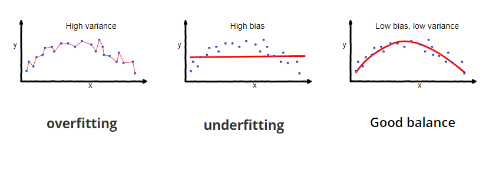
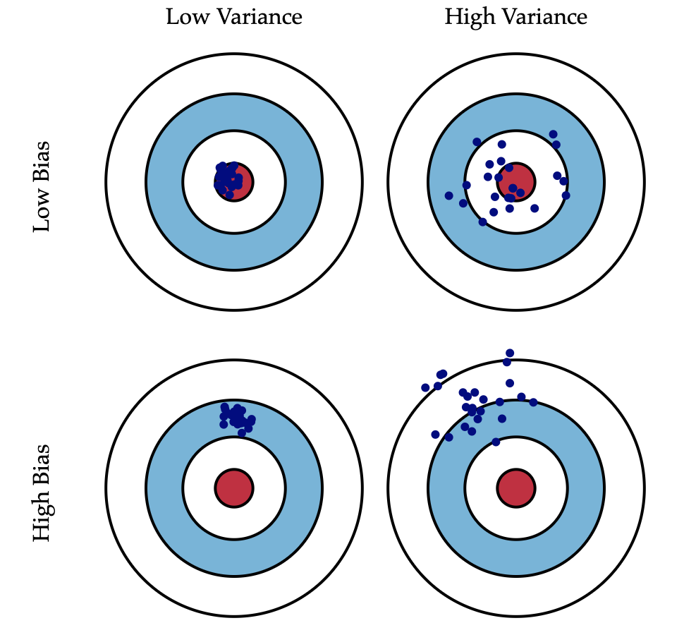
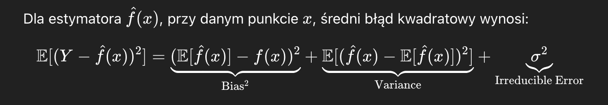
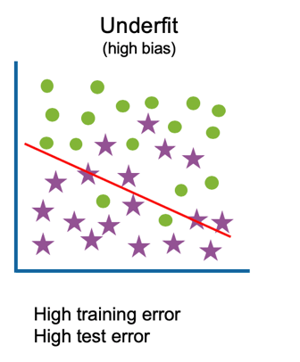
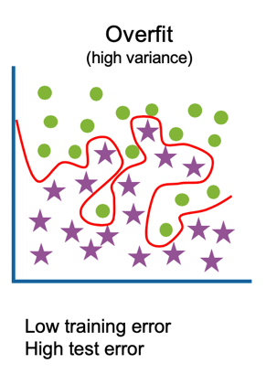

# Bias - variance trade off

opracował: **Kacper Książek**, IiAD 22/23, 417564

---

### 1. Czym jest bias w uczeniu maszynowym?

`Bias` ( ang. stronniczość, uprzedzenie ) to miara skłonności modelu do wybierania określonych wartości w danych, co może prowadzić do błędnych prognoz.

W kontekście uczenia maszynowego, bias odnosi się do tendencyjności modelu do przewidywania określonych wyników na podstawie danych treningowych.

Bias nazywany jest również **błędem systematycznym**. Oznacza to, że model ma tendencję do **systematycznego** popełniania błędów w określony sposób, co może prowadzić do nieprawidłowych prognoz.

### 2. Jaka jest zasada bias-variance tradeoff?

Wizualizacja przedstawiajaca czym jest bias i variance:

`Bias-variance tradeoff` to koncepcja, która odnosi się do balansu pomiędzy dwoma rodzajami błędów, które mogą wystąpić podczas trenowania modelu: **bias** i **variance**.

W celu znaleziania najbardziej optymalnego modelu, należy dążyć do minimalizacji sumy tych dwóch błędów ( czyli do minimalizacji średniego błędu kwadratowego ).

Wzór na średni błąd kwadratowy ( MSE ) jest następujący:

Często dzieje się jednak tak, że zmniejszenie jednego z tych błędów prowadzi do zwiększenia drugiego. 

### 3. Jakie są przykłady modeli o dużym biasie?

Modele o dużym biasie mają tendencję do **niedopasowania** ( ang. underfitting ) do danych treningowych, co oznacza, że nie są w stanie uchwycić złożoności danych.

Przykłady modeli o dużym biasie to:
- **Modele liniowe**: gdy dane mają nieliniowy charakter, modele liniowe mogą mieć duży bias, ponieważ nie są w stanie uchwycić złożoności danych, poprzez mylne założenie, że dane są liniowo zależne.
- **Modele o niskiej złożoności**: drzewa decyzyjne o małej głębokości (2-3), mogą mieć duży bias, ponieważ nie są w stanie uchwycić złożoności danych.
- **Naiwne klasyfikatory Bayesa**: zakładają, że cechy są niezależne, co może prowadzić do dużego biasu, gdy cechy są ze sobą powiązane.

### 4. Jakie są przykłady modeli o dużej wariancji?

Modele o dużej wariancji mają tendencję do **przeuczenia** ( ang. overfitting ) danych treningowych, co oznacza, że są zbyt skomplikowane i uchwycają szum w danych.

Przykłady modeli o dużej wariancji to:
- **Modele o wysokiej złożoności**: drzewa decyzyjne o dużej głębokości (np. 20), mogą mieć dużą wariancję, ponieważ są w stanie uchwycić szum w danych
- **Modele z dużą liczbą parametrów**: sieci neuronowe z wieloma warstwami i neuronami mogą mieć dużą wariancję, ponieważ mają zdolność do uchwycenia szumu w danych
- **Modele z małą ilością danych treningowych**: modele, które są trenowane na małej ilości danych, mogą mieć dużą wariancję, ponieważ są w stanie uchwycić szum w danych, zamiast rzeczywistych wzorców

### 5. W jaki sposób można zminimalizować bias w modelach?

Przede wszystkim, aby zminimalizować bias w modelach, należy sprawić, aby model był optymalnie złożony, czyli aby był w stanie uchwycić złożoność danych, ale nie był zbyt skomplikowany, aby nie uchwycić szumu w danych.

Oto kilka sposobów na zminimalizowanie biasu w modelach:
- **Zastosowanie bardziej skomplikowanego modelu**: jeśli model jest zbyt prosty, można spróbować zastosować bardziej skomplikowany model, który będzie w stanie uchwycić złożoność danych. Przykładowo, jeśli używamy regresji liniowej, możemy spróbować zastosować regresję wielomianową
- **Zwiększenie liczby cech (FE)**: jeśli model ma zbyt mało cech, może mieć duży bias. Można spróbować dodać więcej cech, które będą w stanie uchwycić złożoność danych. Przykładowo, jeśli mamy dane o cenach mieszkań, możemy dodać cechy takie jak lokalizacja, liczba pokoi, powierzchnia itp.
- **Zwiększenie ilości danych treningowych (nie zawsze)**: jeśli model jest trenowany na małej ilości danych, może mieć duży bias. Można spróbować zwiększyć ilość danych treningowych, aby model miał więcej informacji do nauki 

### 6. Jakie techniki pomagają zmniejszyć wariancję

Aby zminimalizować wariancję w modelach, należy sprawić, aby model był mniej skomplikowany, czyli aby nie uchwycił szumu w danych.

Oto kilka sposobów na zminimalizowanie wariancji w modelach:

- **Zastosowanie prostszego modelu**: jeśli model jest zbyt skomplikowany, można spróbować zastosować prostszy model, który będzie w stanie uchwycić rzeczywiste wzorce w danych, ale nie będzie uchwytywał szumu. Przykładowo, jeśli używamy regresji wielomianowej, możemy spróbować zastosować regresję liniową
- **Bagging ( Bootstrap Aggregating )**: technika, która polega na trenowaniu wielu modeli na różnych próbkach danych i łączeniu ich wyników. Przykładem jest Random Forest, który jest zbiorem drzew decyzyjnych trenowanych na różnych próbkach danych
- **Ograniczenie głębokości drzewa decyzyjnego**: jeśli używamy drzewa decyzyjnego, możemy spróbować ograniczyć jego głębokość, aby model był mniej skomplikowany i nie uchwytywał szumu w danych
- **Zwiekszenie ilości danych treningowych**: podobny case jak w punkcie 5. jeśli model jest trenowany na małej ilości danych, może mieć dużą wariancję. Można spróbować zwiększyć ilość danych treningowych, aby model miał więcej informacji do nauki. 